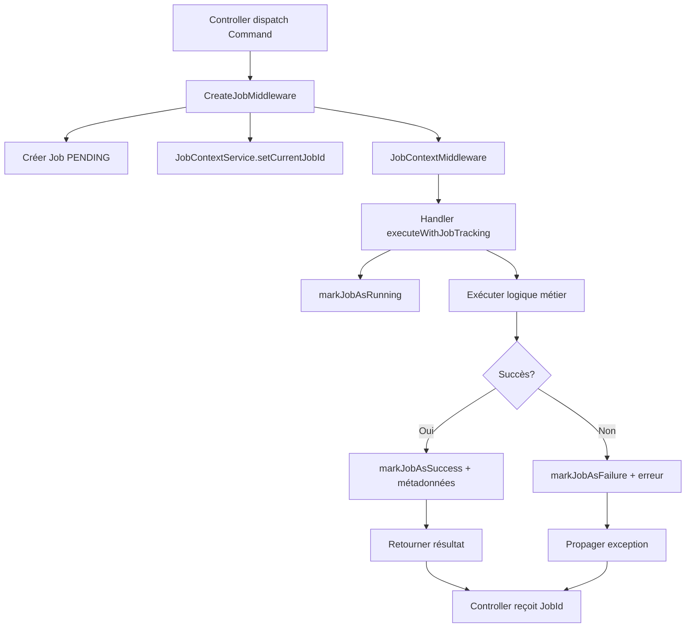

# Patterns d'encapsulation pour le suivi des Jobs

## Vue d'ensemble

J'ai créé plusieurs niveaux d'encapsulation pour simplifier la gestion du cycle de vie des Jobs dans les handlers de commandes.

## 🏗️ Architecture des services

### 1. JobContextService
**Rôle** : Gère le contexte du Job en cours d'exécution
```php
class JobContextService
{
    public function setCurrentJobId(Uuid $jobId): void
    public function getCurrentJobId(): ?Uuid
    public function clearCurrentJobId(): void
}
```

### 2. JobLifecycleService
**Rôle** : Encapsule la logique de gestion du cycle de vie des Jobs
```php
class JobLifecycleService
{
    public function getCurrentJob(): ?Job
    public function markJobAsRunning(): ?Job
    public function markJobAsSuccess(array $metadata = []): ?Job
    public function markJobAsFailure(\Throwable $exception): ?Job
    public function executeWithJobTracking(callable $callback, array $successMetadata = [], ?callable $metadataCallback = null): mixed
}
```

## 📋 Patterns d'utilisation

### Pattern 1 : Service direct (Recommandé)
```php
class CreateStreamCommandHandler
{
    public function __construct(
        private StreamService $streamService,
        private JobLifecycleService $jobLifecycleService
    ) {}

    public function __invoke(CreateStreamCommand $command): Uuid
    {
        return $this->jobLifecycleService->executeWithJobTracking(
            function () use ($command) {
                return $this->streamService->createStream(/* ... */);
            },
            [],
            function ($stream) {
                return ['streamId' => $stream->getId()->toRfc4122()];
            }
        )->getId();
    }
}
```

**Avantages** :
- ✅ Code très propre et lisible
- ✅ Gestion automatique des statuts
- ✅ Métadonnées dynamiques
- ✅ Gestion d'erreurs automatique

### Pattern 2 : Trait
```php
class CreateStreamCommandHandlerV3
{
    use JobTrackingTrait;

    public function __construct(
        private StreamService $streamService,
        JobLifecycleService $jobLifecycleService
    ) {
        $this->setJobLifecycleService($jobLifecycleService);
    }

    public function __invoke(CreateStreamCommand $command): Uuid
    {
        return $this->executeWithJobTracking(/* ... */)->getId();
    }
}
```

**Avantages** :
- ✅ Réutilisable dans plusieurs handlers
- ✅ Interface simplifiée
- ✅ Moins de code répétitif

### Pattern 3 : Classe de base
```php
class CreateStreamCommandHandlerV4 extends BaseCommandHandler
{
    public function __construct(
        private StreamService $streamService,
        JobLifecycleService $jobLifecycleService
    ) {
        parent::__construct($jobLifecycleService);
    }

    public function __invoke(CreateStreamCommand $command): Uuid
    {
        return $this->executeWithJobTracking(/* ... */)->getId();
    }
}
```

**Avantages** :
- ✅ Héritage simple
- ✅ Méthodes protégées disponibles
- ✅ Structure cohérente

## 🔄 Flux de traitement



## 🎯 Fonctionnalités clés

### Gestion automatique des statuts
- **PENDING** → Créé par le middleware
- **RUNNING** → Défini au début de l'exécution
- **SUCCESS** → Défini en cas de succès
- **FAILURE** → Défini en cas d'erreur

### Métadonnées dynamiques
```php
// Métadonnées statiques
['operation' => 'create_stream']

// Métadonnées dynamiques via callback
function ($stream) {
    return ['streamId' => $stream->getId()->toRfc4122()];
}
```

### Gestion d'erreurs
- Capture automatique des exceptions
- Stockage du message d'erreur
- Stockage de la stack trace
- Propagation de l'exception

## 🚀 Utilisation recommandée

Pour la plupart des cas, utilisez le **Pattern 1** (Service direct) car il offre :
- Le meilleur équilibre entre simplicité et flexibilité
- Une gestion automatique complète
- Un code très lisible
- Une facilité de test

Les autres patterns sont utiles pour des cas spécifiques ou des préférences d'architecture particulières.

## 📝 Exemple complet

```php
#[AsMessageHandler]
class CreateStreamCommandHandler
{
    public function __construct(
        private StreamService $streamService,
        private JobLifecycleService $jobLifecycleService
    ) {}

    public function __invoke(CreateStreamCommand $command): Uuid
    {
        return $this->jobLifecycleService->executeWithJobTracking(
            // Callback principal - logique métier
            function () use ($command) {
                return $this->streamService->createStream(
                    $command->fileName,
                    $command->originalFileName,
                    $command->mimeType,
                    $command->size,
                    $command->url,
                    $command->user,
                    $command->options
                );
            },
            // Métadonnées statiques
            ['operation' => 'create_stream'],
            // Callback pour métadonnées dynamiques
            function ($stream) {
                return [
                    'streamId' => $stream->getId()->toRfc4122(),
                    'fileName' => $stream->getFileName(),
                    'size' => $stream->getSize()
                ];
            }
        )->getId();
    }
}
```

Cette approche encapsule complètement la gestion du Job et permet au handler de se concentrer uniquement sur la logique métier ! 🎉
